### Hi, I'm Mitch 👋

I build a GitOps homelab: Talos and Argo CD on Proxmox, local AI on two RTX 3090s with vLLM, and apps that run on hardware I own.

#### Projects

- [talos-argocd-proxmox](https://github.com/mitchross/talos-argocd-proxmox): my production GitOps homelab. [Docs](https://mitchross.github.io/talos-argocd-proxmox/)
- [radar-ng](https://github.com/mitchross/radar-ng): hyper-local weather radar from NOAA data. Expo app with a Kubernetes and Temporal backend.
- [sidero-omni-talos-proxmox-starter](https://github.com/mitchross/sidero-omni-talos-proxmox-starter): starter kit for self-hosted Omni, Talos, and Proxmox.
- [k3s-argocd-starter](https://github.com/mitchross/k3s-argocd-starter): starter kit for k3s and Argo CD.
- [multi_camera_dashboard](https://github.com/mitchross/multi_camera_dashboard): Flutter app to view RTSP streams.
- [epever-solar-monitor](https://github.com/mitchross/epever-solar-monitor): monitoring for Epever MPPT solar charge controllers, with Prometheus metrics and a Grafana dashboard.

#### Stats

<picture>
  <source media="(prefers-color-scheme: dark)" srcset="./profile/stats-dark.svg">
  
</picture>
<picture>
  <source media="(prefers-color-scheme: dark)" srcset="./profile/top-langs-dark.svg">
  
</picture>
